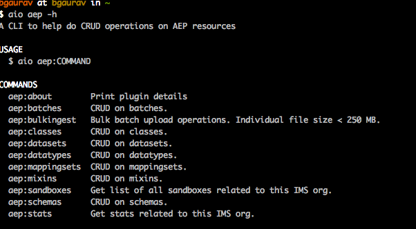

aio-cli-plugin-aep
==================

A plugin for CRUD operations on aep resources


<!-- tocstop -->
# Follow the steps below to start using this plugin.

## 1. **_Set up necessary dependencies for npm to work_**

1. Install brew: ```$ /bin/bash -c "$(curl -fsSL https://raw.githubusercontent.com/Homebrew/install/master/install.sh)"```

2. Install npm: ```$ brew install npm```

3. Install yarn: ```$ npm install --global yarn```

4. Upgrade yarn: ```$ npm upgrade --global yarn```


## 2. **_Set up necessary adobe I/O dependencies_**
 
1. Install aio-cli core libraries```$ npm install -g @adobe/aio-cli```

2. Install aep aio plugin```$ npm install -g @adobe/aio-cli-plugin-aep```

3. Link aep with aio ```$ aio plugins:install @adobe/aio-cli-plugin-aep```

4. When you run ```$ aio aep -h``` now you should be able to see aep in the list of available plugins



## 3. **_Set up adobe I/O (PROD/STG/INT) integration_**
      
##      **For PROD**

1. Go to https://console.adobe.io/integrations and create a production integration for test

2. Follow the instructions on https://www.adobe.io/apis/experienceplatform/home/tutorials/alltutorials.html#!api-specification/markdown/narrative/tutorials/authenticate_to_acp_tutorial/authenticate_to_acp_tutorial.md

   to get the necessary I/O config credentials

3. Create a ```config.json``` file with the following content and replacing the placeholders with actual values. The ```jwt_payload``` element in the following json, you can directly copy from your Adobe I/O integrations page mentioned in step 1.
```javascript 1.8

{
  "client_id": "${your_client_id}",
  "client_secret": "${your_client_secret}",
  "jwt_payload": {
    "exp": ${your_expiration_time},
    "iss": "${your_org@AdobeOrg}",
    "sub": "${your_tech_id@techacct.adobe.com}",
    "https://ims-na1.adobelogin.com/s/ent_dataservices_sdk": true,
    "aud": "https://ims-na1.adobelogin.com/c/${your_client_id}"
  },
  "token_exchange_url": "https://ims-na1.adobelogin.com/ims/exchange/jwt/",
  "x-sandbox-id": "${your_sandbox_id}",
  "x-sandbox-name": "${your_sandbox_name}",
  "env": "prod"
}

```
Run the following commands now (in the particular order)

5. ``` $ aio config:set jwt-auth ${path_to_the_above_config.json} --file --json ```

6. ``` $ aio jwt-auth:access-token ```


##      **For STG/INT** (This sample is for INT)

1. Go to https://console-stage.adobe.io/integrations and create a production integration for test

2. Follow the instructions on https://www.adobe.io/apis/experienceplatform/home/tutorials/alltutorials.html#!api-specification/markdown/narrative/tutorials/authenticate_to_acp_tutorial/authenticate_to_acp_tutorial.md

   to get the necessary I/O config credentials

3. Create a ```config.json``` file with the following content and replacing the placeholders with actual values. The ```jwt_payload``` element in the following json, you can directly copy from your Adobe I/O integrations page mentioned in step 1.
```javascript 1.8

{
  "client_id": "${your_client_id}",
  "client_secret": "${your_client_secret}",
  "jwt_payload": {
    "exp": ${your_expiration_time},
    "iss": "${your_org@AdobeOrg}",
    "sub": "${your_tech_id@techacct.adobe.com}",
    "https://ims-na1-stg1.adobelogin.com/s/ent_dataservices_sdk": true,
    "aud": "https://ims-na1-stg1.adobelogin.com/c/${your_client_id}"
  },
  "token_exchange_url": "https://ims-na1-stg1.adobelogin.com/ims/exchange/jwt/",
  "x-sandbox-id": "${your_sandbox_id}",
  "x-sandbox-name": "${your_sandbox_name}",
  "env": "int"
}

```
Run the following commands now (in the particular order)

5. ``` $ aio config:set jwt-auth ${path_to_the_above_config.json} --file --json ```

6. ``` $ aio jwt-auth:access-token ```


## 4. **_Finally run this simple command to list datasets in your org to make sure the configuration is all correct_**

   ```$ aio aep:datasets:list```
 
 Output would look something like...  
  
   ```javascript 1.8
{
	'abc': {
		tags: {
			targetDataSetId: ['abc'],
			'aep/siphon/partitions': [],
			'adobe/pqs/table': ['abc'],
			sandboxId: ['abc'],
			mappingId: ['abc'],
			acp_validationContext: ['enabled']
		},
		imsOrg: 'abc@AdobeOrg',
		name: 'Mapping DataSet_abc',
		namespace: 'ACP',
		state: 'DRAFT',
		lastBatchId: 'abc',
		lastBatchStatus: 'success',
		version: '1.0.3',
		created: 1573866068596,
		updated: 1573866132606,
		createdClient: 'acp_foundation_connectors',
		createdUser: 'abc@AdobeID',
		updatedUser: 'acp_foundation_dataTracker@AdobeID',
		lastSuccessfulBatch: 'abc',
		viewId: 'abc',
		aspect: 'production',
		status: 'enabled',
		fileDescription: {
			persisted: false
		},
		files: '@/dataSets/abc/views/abc/files',
		schemaMetadata: {
			primaryKey: [],
			delta: [],
			dule: [],
			gdpr: []
		},
		schemaRef: {
			id: 'https://ns.adobe.com/acponboarding/schemas/abc',
			contentType: 'application/vnd.adobe.xed-full+json;version=1'
		},
		streamingIngestionEnabled: 'false'
	},

...
```
You can choose not to read the following additional information.

## **Additional read**

The last command would generate a new ```access_token``` value and place it in appropriate folder for every command to read. 
Think of it as the same parameter we pass in the ```Authorization``` header on postman/Curl. 

You can also get the ```access_token``` manually and use the following command to set it. No need to do this if you have done step 2.

Please follow the instructions as suggested in this article, to get the access_token https://www.adobe.io/apis/experienceplatform/home/tutorials/alltutorials.html#!api-specification/markdown/narrative/tutorials/authenticate_to_acp_tutorial/authenticate_to_acp_tutorial.md#generate-access-token

``` $ aio config:set jwt-auth.access_token ${your_access_token_generated_through_adobeI/O_integration} ```


Additionally if you want to have multiple integrations and want the ability to quickly switch between them, create multiple ```config.json``` files and place each one of them in a corresponding folder
in your root directory with aprropriate name.
For example, if you want to create an integration with name 'abc'. Please place the corresponding ```config.json``` file in ```/Users/${your_user_name}/abc```. And then run the command

```$ aio aep:switch-config:set -n=abc```


## 5. (Developers) **_To run unit tests from the root folder of the project run the commands in following order_**

```$ npm install```

```$ jest```

```$ jest --coverage``` (to see coverage report)
